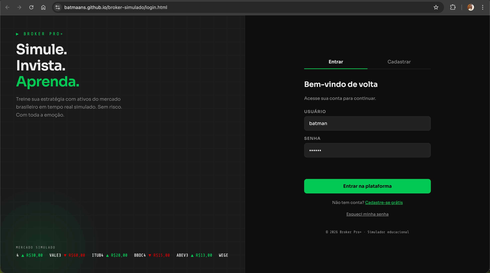
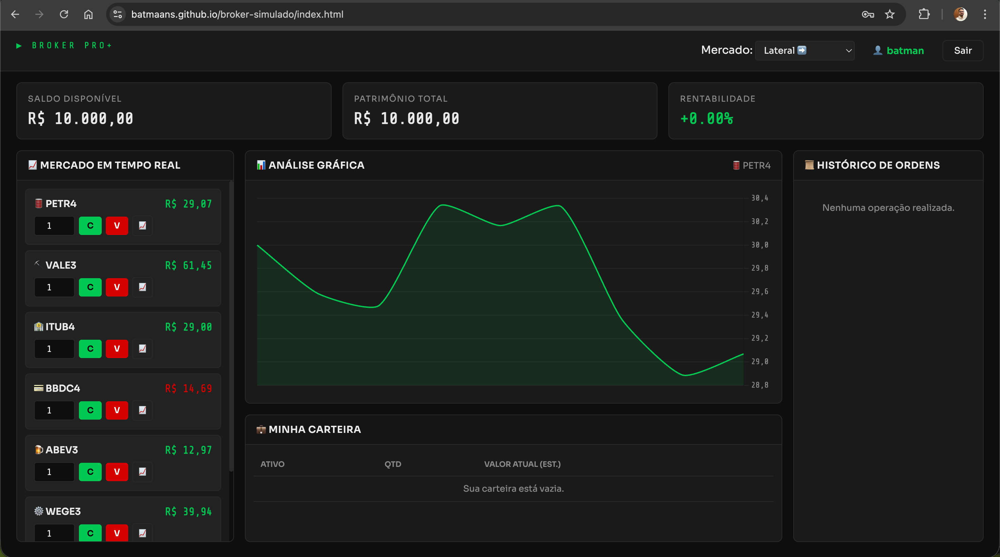

# broker-simulado
Este é um sistema simulador de broker.

# 📈 Broker Pro+

> Simulador de investimentos da bolsa brasileira rodando direto no navegador — sem risco, com toda a emoção do mercado real.

<p align="center">
  <a href="https://batmaans.github.io/broker-simulado/login.html">
    
  </a>
</p>

---

## 📋 Descrição

O **Broker Pro+** é uma aplicação web educacional que simula o funcionamento de uma corretora de valores. O usuário cria uma conta, recebe **R$ 10.000,00 de saldo virtual** e pode comprar e vender ações de empresas reais da bolsa brasileira (B3) com preços que variam em tempo real — sem arriscar dinheiro de verdade.

---

## 🖥️ Screenshots

### Tela de Login / Cadastro


### Dashboard — Mercado em Tempo Real


### Perfil do Usuário


---

## 🛠️ Tecnologias

| Tecnologia | Uso |
|---|---|
| HTML5 | Estrutura das páginas |
| CSS3 | Estilização e layout responsivo |
| JavaScript (ES6+) | Lógica de negócio e interatividade |
| [Chart.js](https://www.chartjs.org/) | Gráficos de variação de preço |
| LocalStorage API | Persistência de dados dos usuários |
| SessionStorage API | Controle de sessão do usuário logado |
| Google Fonts | Tipografia (Sora + Share Tech Mono) |

---

## ⚙️ Funcionalidades

- 🔐 **Autenticação** — cadastro, login, logout e recuperação de senha via pergunta de segurança
- 📈 **Mercado simulado** — 7 ativos da B3 com preços atualizados a cada 2 segundos
- 🎛️ **Modos de mercado** — Alta, Baixa, Lateral e Aleatório
- 📊 **Gráfico interativo** — histórico de preço de cada ativo em tempo real
- 💼 **Carteira** — acompanhamento dos ativos comprados e valor atual
- 📜 **Histórico de ordens** — registro de todas as compras e vendas realizadas
- 👤 **Perfil do usuário** — gerenciar saldo, alterar senha, escolher avatar e estatísticas da conta

---

## 🚀 Como executar localmente

Não é necessário instalar nada. Por ser uma aplicação front-end pura, basta:

**1. Clone o repositório**
```bash
git clone https://github.com/batmaans/broker-simulado.git
```

**2. Acesse a pasta do projeto**
```bash
cd broker-simulado
```

**3. Abra o arquivo de login no navegador**
```bash
# No Windows
start login.html

# No Mac
open login.html

# No Linux
xdg-open login.html
```

> ⚠️ **Dica:** para evitar problemas com CORS ao carregar fontes externas, prefira abrir com uma extensão como [Live Server](https://marketplace.visualstudio.com/items?itemName=ritwickdey.LiveServer) no VS Code.

---

## 🌐 Link de produção

**🔗 https://batmaans.github.io/broker-simulado/login.html**

---

## 👨‍💻 Autores

<table>
  <tr>
    <td align="center">
      <b>Gustavo Roberto Silva Pereira</b><br>
      <a href="https://github.com/batmaans">@batmaans</a>
    </td>
    <td align="center">
      <b>João Pedro Martins de Souza</b><br>
      <a href="https://github.com/JPMSz">@JPMSz</a>
    </td>
  </tr>
</table>

---

Este projeto foi desenvolvido para fins educacionais.  
© 2026 Broker Pro+ · Simulador educacional